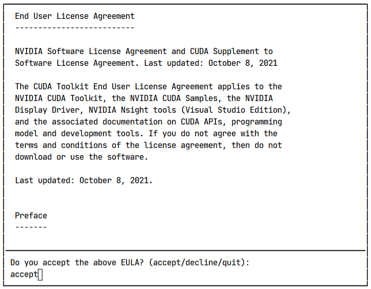
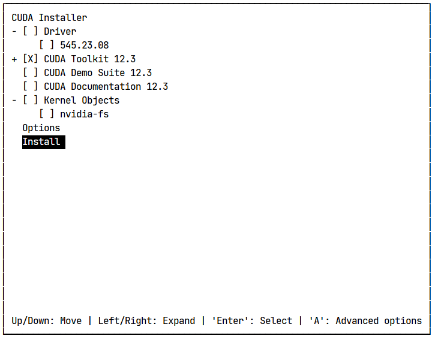
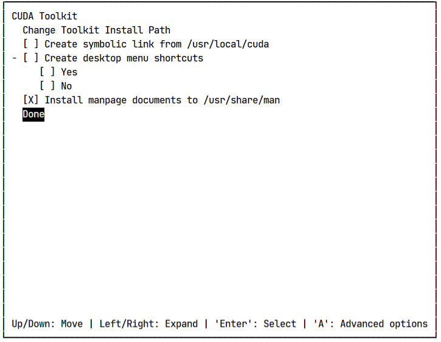
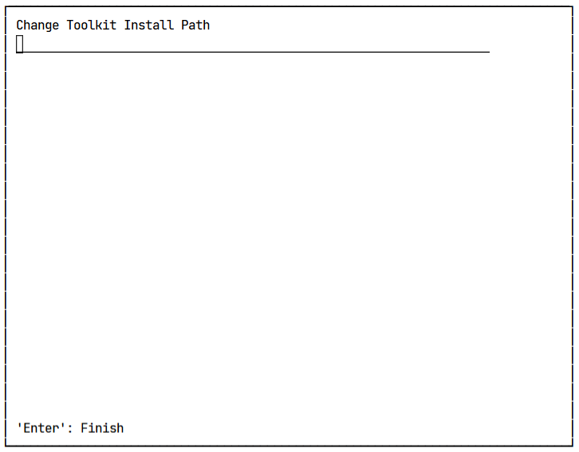

# Getting Started with NVIDIA Toolkit, gcc, and llama.cpp on Gilbreth Cluster

Welcome to the quick start guide for running `llama.cpp` on the Gilbreth cluster **without root access**.

## Why This Guide is Necessary

On the Gilbreth cluster, users often face the issue of the lack of sudo access. This limitation restricts the ability to install packages or update system libraries (which are very old on these clusters).

This repository has a set of bash scripts that allow users to install and configure gcc and the NVIDIA Toolkit in a user-specific directory. This approach ensures that you can run `llama.cpp` without the need for administrative privileges.

### Before You Start

Ensure you have permission to execute scripts and access the Gilbreth cluster. Familiarity with basic terminal commands and the Linux environment will be helpful.

## 0. E-Lab Members

Members of the E-Lab with access to the depot can simply copy the contents of launch.sh into their `~/.bashrc` and `source ~/.bashrc`. 
Skip to [Running Inference](https://github.com/AkshathRaghav/llama_set_up_gilbreth/tree/main?tab=readme-ov-file#running-inference).

## 1. NVIDIA Toolkit Installation

The NVIDIA Toolkit includes libraries and tools essential for developing applications that leverage NVIDIA GPUs.

Extras: 
- https://developer.nvidia.com/cuda-downloads?target_os=Linux&target_arch=x86_64&Distribution=CentOS&target_version=7&target_type=runfile_local
- https://stackoverflow.com/questions/39379792/install-cuda-without-root

### Steps:

1. **Configure Installation Directory**:
   - Edit `nvidia-toolkit.sh` to specify your installation directory by changing the `ROOT_DIR` variable.

2. **Execute the Script**:
   ```bash
   bash nvidia-toolkit.sh
   ```
   Complete the setup by following the prompts.

### Toolkit Setup 

1. Type `accept` in the console.
<div align="center">
  
</div>

2. Use `ENTER` to select/deselect settings. Make sure the settings screen looks like the following image: 
<div align="center">
  
</div>

3. Hover over the `CUDA Toolkit 12.3` option, and press `A`. Deselect all of the settings here except `Install manpage documents...` 
<div align="center">
  
</div>


4. Hover over `Change Toolkit Install Path`. Hit `ENTER` and add the $TOOLKIT variable path here. 
<div align="center">
  
</div>

5. Finally, exit out into the main menu, hover over `Install` and hit `ENTER`. 

Now, add these lines to the bottom of your `~/.bashrc` file. 
```bash 
export TOOLKIT={}

# Leave as is
export PATH=$TOOLKIT/bin:$PATH
export LD_LIBRARY_PATH=$TOOLKIT/lib64:$LD_LIBRARY_PATH
```
```bash 
source ~/.bashrc
```

## 2. gcc Installation

gcc (GNU Compiler Collection) is a compiler system supporting various programming languages, crucial for software development and execution. Gilbreth, and other clusters like Negishi, use a version below <11.x.x>. llama.cpp requires a higher version. We will be using the latest version: <12.3.0>.

Extra:
- https://gcc.gnu.org/install/configure.html 
- https://stackoverflow.com/questions/10279829/installing-glib-in-non-standard-prefix-fails
- https://github.com/ggerganov/llama.cpp/issues/552

### Steps:

1. **Configure Installation Directory**:
   - Open `gcc.sh` in a text editor.
   - Set `ROOT_DIR` to your desired installation directory.
   - The script ensures that `srcdir` (SRC_DIR) and `objdir` (BUILD_DIR) are different directories. If you do wish to change these paths, make sure that they point to different locations. 

2. **Run the Script**:
   ```bash
   bash gcc.sh
   ```

If you face any issues, run `make -k distclean && make -k clean` to undo what was done by `./configure` and `make`. Then, debug. Otherwise, this will cause issues down the line.

Now, add these lines to the bottom of your `~/.bashrc` file. 
```bash 
export ROOT_DIR={}
export SRC_DIR=$ROOT_DIR/gcc/gcc_src # Change this is needed
export BUILD_DIR=$ROOT_DIR/gcc/gcc_build # Change this if neeeded

# Leave as is
export CC=gcc
export PATH=$BUILD_DIR/bin:$PATH
export LD_LIBRARY_PATH=$BUILD_DIR/local/lib:$BUILD_DIR/lib:$BUILD_DIR/local/lib64:$BUILD_DIR/lib64:$LD_LIBRARY_PATH
```
```bash 
source ~/.bashrc
```

## 3. Running llama.cpp

With gcc and the NVIDIA Toolkit set up, you're now ready to compile and run `llama.cpp`.

Extras: 
- https://github.com/ggerganov/llama.cpp?tab=readme-ov-file
- https://stackoverflow.com/questions/39649102/how-do-i-select-which-gpu-to-run-a-job-on
- https://kubito.dev/posts/llama-cpp-linux-nvidia/

### Steps:

0. **NOTE:** If you have run the above scripts in a previous session, then ensure you have added the environoment paths to your `~/.bashrc` file with the same paths you used in `gcc.sh` and `nvidia-toolkit.sh`. This sets the paths to look at our local installations. 

1. **Download the llama Script**: `llama.sh` is designed to compile and execute `llama.cpp` using the previously installed tools.
   
2. **Configure Installation Directory**:
   - Modify `llama.sh`, setting `LLAMA_DIR` to the directory where gcc and the NVIDIA Toolkit are installed.

3. **Launch the Script**:
   ```bash
   bash llama.sh
   ```
   This script compiles `llama.cpp` and runs it. Follow any instructions or prompts that appear.

### Running inference

Ensure all of these lines exist within your `~/.bashrc` file. 
```bash 
export ROOT_DIR=/depot/euge/data/araviki
export TOOLKIT=$ROOT_DIR/nvidia-toolkit/12.3
export SRC_DIR=$ROOT_DIR/gcc/gcc_src
export BUILD_DIR=$ROOT_DIR/gcc/gcc_build

# Leave as is
export PATH=$TOOLKIT/bin:$BUILD_DIR/bin:$PATH
export LD_LIBRARY_PATH=$TOOLKIT/lib64:$BUILD_DIR/local/lib:$BUILD_DIR/lib:$BUILD_DIR/local/lib64:$BUILD_DIR/lib64:$LD_LIBRARY_PATH
export LLAMA=$ROOT_DIR/llama
```

Now, you are ready to run llama.cpp. I've bound the path of my main `llama` folder to `$LLAMA`, so that I can call it as follows: 
```bash 
# - araviki
   # - llama
      # - gguf # Storing quantized models
      # - llama.cpp # src
         # - main
         # - prompts/
         # - grammars/

$LLAMA/llama.cpp/main --color --interactive --model $LLAMA/gguf/llama-2-13b.Q5_K_M.gguf --n-predict 512 --repeat_penalty 1.0 --n-gpu-layers 15000 --reverse-prompt "User:" --in-prefix " " -f $LLAMA/llama.cpp/prompts/chat-with-bob.txt
```

**The output shown below is run on a single A100-80GB instance.**

```
Log start
main: build = 2295 (87c91c07)
main: built with gcc (GCC) 12.2.0 for x86_64-pc-linux-gnu
main: seed  = 1709276455
llama_model_loader: loaded meta data with 19 key-value pairs and 363 tensors from /depot/euge/data/araviki/llama/gguf/llama-2-13b.Q5_K_M.gguf (version GGUF V2)
llama_model_loader: Dumping metadata keys/values. Note: KV overrides do not apply in this output.
llama_model_loader: - kv   0:                       general.architecture str              = llama
llama_model_loader: - kv   1:                               general.name str              = LLaMA v2
llama_model_loader: - kv   2:                       llama.context_length u32              = 4096
llama_model_loader: - kv   3:                     llama.embedding_length u32              = 5120
llama_model_loader: - kv   4:                          llama.block_count u32              = 40
llama_model_loader: - kv   5:                  llama.feed_forward_length u32              = 13824
llama_model_loader: - kv   6:                 llama.rope.dimension_count u32              = 128
llama_model_loader: - kv   7:                 llama.attention.head_count u32              = 40
llama_model_loader: - kv   8:              llama.attention.head_count_kv u32              = 40
llama_model_loader: - kv   9:     llama.attention.layer_norm_rms_epsilon f32              = 0.000010
llama_model_loader: - kv  10:                          general.file_type u32              = 17
llama_model_loader: - kv  11:                       tokenizer.ggml.model str              = llama
llama_model_loader: - kv  12:                      tokenizer.ggml.tokens arr[str,32000]   = ["<unk>", "<s>", "</s>", "<0x00>", "<...
llama_model_loader: - kv  13:                      tokenizer.ggml.scores arr[f32,32000]   = [0.000000, 0.000000, 0.000000, 0.0000...
llama_model_loader: - kv  14:                  tokenizer.ggml.token_type arr[i32,32000]   = [2, 3, 3, 6, 6, 6, 6, 6, 6, 6, 6, 6, ...
llama_model_loader: - kv  15:                tokenizer.ggml.bos_token_id u32              = 1
llama_model_loader: - kv  16:                tokenizer.ggml.eos_token_id u32              = 2
llama_model_loader: - kv  17:            tokenizer.ggml.unknown_token_id u32              = 0
llama_model_loader: - kv  18:               general.quantization_version u32              = 2
llama_model_loader: - type  f32:   81 tensors
llama_model_loader: - type q5_K:  241 tensors
llama_model_loader: - type q6_K:   41 tensors
llm_load_vocab: special tokens definition check successful ( 259/32000 ).
llm_load_print_meta: format           = GGUF V2
llm_load_print_meta: arch             = llama
llm_load_print_meta: vocab type       = SPM
llm_load_print_meta: n_vocab          = 32000
llm_load_print_meta: n_merges         = 0
llm_load_print_meta: n_ctx_train      = 4096
llm_load_print_meta: n_embd           = 5120
llm_load_print_meta: n_head           = 40
llm_load_print_meta: n_head_kv        = 40
llm_load_print_meta: n_layer          = 40
llm_load_print_meta: n_rot            = 128
llm_load_print_meta: n_embd_head_k    = 128
llm_load_print_meta: n_embd_head_v    = 128
llm_load_print_meta: n_gqa            = 1
llm_load_print_meta: n_embd_k_gqa     = 5120
llm_load_print_meta: n_embd_v_gqa     = 5120
llm_load_print_meta: f_norm_eps       = 0.0e+00
llm_load_print_meta: f_norm_rms_eps   = 1.0e-05
llm_load_print_meta: f_clamp_kqv      = 0.0e+00
llm_load_print_meta: f_max_alibi_bias = 0.0e+00
llm_load_print_meta: n_ff             = 13824
llm_load_print_meta: n_expert         = 0
llm_load_print_meta: n_expert_used    = 0
llm_load_print_meta: pooling type     = 0
llm_load_print_meta: rope type        = 0
llm_load_print_meta: rope scaling     = linear
llm_load_print_meta: freq_base_train  = 10000.0
llm_load_print_meta: freq_scale_train = 1
llm_load_print_meta: n_yarn_orig_ctx  = 4096
llm_load_print_meta: rope_finetuned   = unknown
llm_load_print_meta: model type       = 13B
llm_load_print_meta: model ftype      = Q5_K - Medium
llm_load_print_meta: model params     = 13.02 B
llm_load_print_meta: model size       = 8.60 GiB (5.67 BPW) 
llm_load_print_meta: general.name     = LLaMA v2
llm_load_print_meta: BOS token        = 1 '<s>'
llm_load_print_meta: EOS token        = 2 '</s>'
llm_load_print_meta: UNK token        = 0 '<unk>'
llm_load_print_meta: LF token         = 13 '<0x0A>'
llm_load_tensors: ggml ctx size =    0.28 MiB
llm_load_tensors: offloading 40 repeating layers to GPU
llm_load_tensors: offloading non-repeating layers to GPU
llm_load_tensors: offloaded 41/41 layers to GPU
llm_load_tensors:        CPU buffer size =   107.42 MiB
llm_load_tensors:      CUDA0 buffer size =  8694.21 MiB
....................................................................................................
llama_new_context_with_model: n_ctx      = 512
llama_new_context_with_model: freq_base  = 10000.0
llama_new_context_with_model: freq_scale = 1
ggml_init_cublas: GGML_CUDA_FORCE_MMQ:   no
ggml_init_cublas: CUDA_USE_TENSOR_CORES: yes
ggml_init_cublas: found 1 CUDA devices:
  Device 0: NVIDIA A100 80GB PCIe, compute capability 8.0, VMM: yes
llama_kv_cache_init:      CUDA0 KV buffer size =   400.00 MiB
llama_new_context_with_model: KV self size  =  400.00 MiB, K (f16):  200.00 MiB, V (f16):  200.00 MiB
llama_new_context_with_model:  CUDA_Host input buffer size   =    12.01 MiB
llama_new_context_with_model:      CUDA0 compute buffer size =    81.00 MiB
llama_new_context_with_model:  CUDA_Host compute buffer size =    10.00 MiB
llama_new_context_with_model: graph splits (measure): 2

system_info: n_threads = 32 / 64 | AVX = 1 | AVX_VNNI = 0 | AVX2 = 1 | AVX512 = 0 | AVX512_VBMI = 0 | AVX512_VNNI = 0 | FMA = 1 | NEON = 0 | ARM_FMA = 0 | F16C = 1 | FP16_VA = 0 | WASM_SIMD = 0 | BLAS = 0 | SSE3 = 1 | SSSE3 = 1 | VSX = 0 | MATMUL_INT8 = 0 | 
main: interactive mode on.
Reverse prompt: 'User:'
Input prefix: ' '
sampling: 
        repeat_last_n = 64, repeat_penalty = 1.000, frequency_penalty = 0.000, presence_penalty = 0.000
        top_k = 40, tfs_z = 1.000, top_p = 0.950, min_p = 0.050, typical_p = 1.000, temp = 0.800
        mirostat = 0, mirostat_lr = 0.100, mirostat_ent = 5.000
sampling order: 
CFG -> Penalties -> top_k -> tfs_z -> typical_p -> top_p -> min_p -> temperature 
generate: n_ctx = 512, n_batch = 512, n_predict = 512, n_keep = 1


== Running in interactive mode. ==
 - Press Ctrl+C to interject at any time.
 - Press Return to return control to LLaMa.
 - To return control without starting a new line, end your input with '/'.
 - If you want to submit another line, end your input with '\'.

 Transcript of a dialog, where the User interacts with an Assistant named Bob. Bob is helpful, kind, honest, good at writing, and never fails to answer the User's requests immediately and with precision.

User: Hello, Bob.
Bob: Hello. How may I help you today?
User: Please tell me the largest city in Europe.
Bob: Sure. The largest city in Europe is Moscow, the capital of Russia.
User: 

llama_print_timings:        load time =    1439.09 ms
llama_print_timings:      sample time =       0.00 ms /     1 runs   (    0.00 ms per token,      inf tokens per second)
llama_print_timings: prompt eval time =      73.35 ms /    99 tokens (    0.74 ms per token,  1349.66 tokens per second)
llama_print_timings:        eval time =       0.00 ms /     1 runs   (    0.00 ms per token,      inf tokens per second)
llama_print_timings:       total time =    1017.78 ms /   100 tokens
```